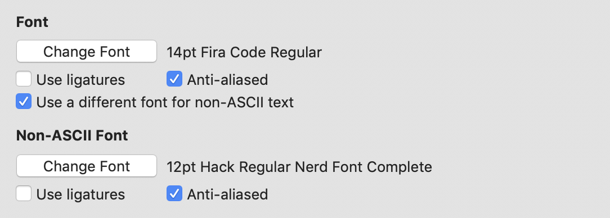

# 개발환경 설정하기!

> 개발자 각자마다 취향이 다를 수 있습니다. :-)

## Tools

### iTerm2

이 [링크](https://www.iterm2.com/)에서 다운받을 수 있습니다.

### homebrew

[맥용 패키지 관리도구](https://brew.sh/index_ko) 입니다

```bash

/usr/bin/ruby -e "$(curl -fsSL https://raw.githubusercontent.com/Homebrew/install/master/install)"

```

### zsh

brew 를 이용해 [zsh를 설치](https://github.com/robbyrussell/oh-my-zsh/wiki/Installing-ZSH)합니다.

```bash

brew install zsh zsh-completions

```

기본 shell 을 zsh 로 변경합니다.

```bash

chsh -s /bin/zsh

```

#### oh-my-zsh

zsh를 사용하기로 결심했다면, 반드시 사용하길 추천하는 [oh-my-zsh](https://github.com/robbyrussell/oh-my-zsh/)를 설치합니다. curl 또는 wget을 이용하여 설치합니다.

```bash

# curl

sh -c "$(curl -fsSL https://raw.githubusercontent.com/robbyrussell/oh-my-zsh/master/tools/install.sh)"

# wget

sh -c "$(wget https://raw.githubusercontent.com/robbyrussell/oh-my-zsh/master/tools/install.sh -O -)"

```

#### zsh theme

전 개인적으로 [spaceship-prompt](https://github.com/denysdovhan/spaceship-prompt)를 가장 선호합니다. FiraCode 폰트와 궁합이 좋기도 하고, 직관적인 인디케이터들도 마음에 듭니다.


```bash

npm install -g spaceship-prompt

```

`~/.zshrc`에 테마를 변경해주고, 새로 실행하면 적용됩니다.

```bash

...
ZSH_THEME="spaceship"
...

```

#### [zsh-syntax-highlighting](https://github.com/zsh-users/zsh-syntax-highlighting)

zsh 의 syntax highlighting 도구를 설치합니다.

```bash

brew install zsh-syntax-highlighting

```

`~/.zshrc`의 plugins 항목에 `zsh-syntax-highlighting`을 추가합니다.

```bash

plugins=( [...plugins] zsh-syntax-highlighting)

```

zsh를 재실행하면 적용됩니다.

### [colorls](https://github.com/athityakumar/colorls#installation)

ruby를 설치합니다.

```bash

brew install ruby

```

`gem`을 이용하여 colorls를 설치합니다.

```bash

gem install colorls

```

`~/.zshrc`에 alias를 추가합니다. (기존 ls를 대체하기 위해 ls alias도 지정합니다.)

```bash

alias ls="colorls"
alias ll="colorls -al"
alias lc="colorls -lA --sd"

```

## Fonts

코드를 미려하게 표현해줄 폰트를 설치합니다.

### FiraFont


[github](https://github.com/tonsky/FiraCode) 페이지를 통해 다운로드 링크를 확인할 수 있습니다.

### NerdFonts

iconic font 입니다.


github 페이지를 통해 설치방법을 안내받을 수 있으며, homebrew를 사용하는 경우 아래의 코드로 설치할 수 있습니다.

```bash

brew tap caskroom/fonts
brew cask install font-hack-nerd-font

```

iTerm2를 사용하는 경우 Preference > Profiles > Text 에서 Non-ASCII Font 항목을 활성화하고 해당 폰트를 `Hack Regular Nerd Font`로 설정해주셔야 정상적으로 표시됩니다.


