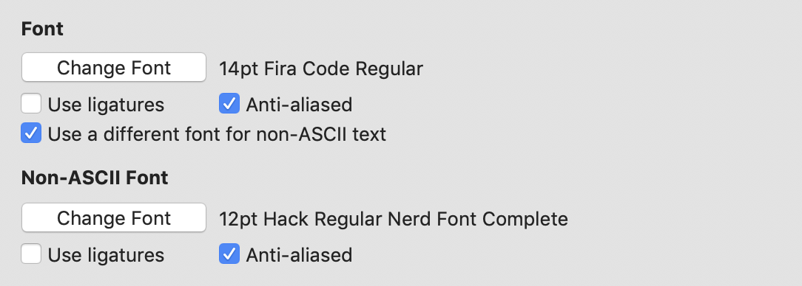

최근 회사에서 지급되어 사용하던 아이맥이 갑작스럽게 사망하는 바람에, 임시 아이맥을 지급받았습니다. 경황이 없어 타임머신 백업도 남겨두지 못한 채 먼 길을 떠나 버렸습니다.

새롭게 개발환경을 설정하면서, 자주 찾아볼 일은 없지만 막상 필요할 땐 아쉬운 내용들을 정리해두고자 합니다. Mac 환경을 기준으로 작성되었으며, 작성 시기 및 개인의 환경에 따라 동작 및 결과가 다를 수 있음을 참고 부탁드립니다. 또한 대부분의 도구들은 FrontEnd 개발 환경을 기준으로 정리하였음을 미리 알립니다.

# 개발환경 설정하기

완전히 깨끗한 아이맥을 만나는 일은 너무나 즐겁습니다. :-) (물론 회사에서 새 장비를 받는다는 건 즐겁기만 한 일은 아닐 수 있죠.) 즐거움도 잠시 일을 하기 위해 개발환경을 설정해야 할텐데, 여간 번거로운 일이 아닙니다. 하지만 일은 해야하므로, 제가 업무를 위해 개발 환경을 구성하는 내용을 공유하고자 합니다.

**목차**

1. [개발도구](#Applications)
2. [폰트](#fonts)
3. [기타설정](#others)

## <a id="Applications"></a>개발도구

### VSCode


저는 Microsoft가 만든 [VSCode](https://code.visualstudio.com/download)를 사용합니다. 동작속도나 코드 작성도구로써 무척 만족스러워 추천합니다. 다양한 확장 도구들을 이용해 더욱 편리한 개발환경을 꾸밀 수 있습니다. 잦은 업데이트를 통해 그 기능을 계속 발전시켜 나가고 있어 점점 더 유용성이 높아지고 있습니다.

### iTerm


Mac 자체의 터미널도 충분히 잘 활용하실 수 있지만, 다양한 설정이 가능 점에서 [iTerm](https://www.iterm2.com/downloads.html)을 사용하고 있습니다. 다양한 color scheme들도 활용할 수 있고, [여기](https://github.com/mbadolato/iTerm2-Color-Schemes)서 확인하실 수 있습니다.

### Chrome


막강한 개발자 도구는 언제나 유용합니다.

### FireFox


크롬과 더불어 유용한 개발자 도구를 제공합니다.

### Homebrew

```bash

/usr/bin/ruby -e "$(curl -fsSL https://raw.githubusercontent.com/Homebrew/install/master/install)"

```

맥용 패키지 관리 도구입니다.

### NodeJS

homebrew 를 통해서 간단하게 설치가능합니다.

```bash

brew install nodejs

```

### zsh

```bash

// install
brew install zsh zsh-completions

// to set zsh as default shell
chsh -s /bin/zsh

```

### zsh-syntax-highlighting

```bash
brew install zsh-syntax-highlighting
```

.zshrc 파일에 아래 내용을 추가합니다.

```bash
source /usr/local/share/zsh-syntax-highlighting/zsh-syntax-highlighting.zsh
```

### zsh-autosuggetions

zsh 사용시 자동완성을 도와주는 플러그인입니다.

```bash
brew install zsh-autosuggestions
```

.zshrc 파일에 아래 내용을 추가합니다.

```bash
source /usr/local/share/zsh-autosuggestions/zsh-autosuggestions.zsh
```

### oh-my-zsh

zsh 쉘의 설정을 도와주는 도구입니다. zsh 쉘을 선택하면, 기본적으로 함께 사용하는 것을 추천합니다. curl 이나 wget 을 이용해 설치하실 수 있습니다.

```bash
// via curl
sh -c "$(curl -fsSL https://raw.githubusercontent.com/robbyrussell/oh-my-zsh/master/tools/install.sh)"

// via wget
sh -c "$(wget https://raw.githubusercontent.com/robbyrussell/oh-my-zsh/master/tools/install.sh -O -)"
```

### colorls

[Github](https://github.com/athityakumar/colorls#installation)


설치를 위해 ruby가 필요하므로, 없는 경우 homebrew를 이용하여 ruby를 설치합니다.

```bash
brew install ruby
```

ruby의 패키지 매니저인 gem을 이용해 colorls를 설치합니다.

```bash
gem install colorls
```

.zshrc 파일에 alias만 지정합니다.

```bash
alias ll="colorls -al"
alias lc="colorls -lA --sd"

...

source $(dirname $(gem which colorls))/tab_complete.sh
```

다양한 옵션들을 제공하고 있으며, 다른 옵션들이 궁금하다면 colorls --help를 통해서 확인하거나, [github](https://github.com/athityakumar/colorls#installation)에서 확인할 수 있습니다.

## <a id="fonts"></a>Fonts

### FiraCode

[Github](https://github.com/tonsky/FiraCode)

```bash
brew tap caskroom/fonts
brew cask install font-fira-code
```

### Nerd-Fonts

[Github](https://github.com/ryanoasis/nerd-fonts)

colorls 사용시 아이콘들을 표시해줄 수 있는 폰트입니다.

```bash
brew tap caskroom/fonts
brew cask install font-hack-nerd-font
```

iTerm2 에서 사용하기 위해서는 iTerm2 > Preference > Profiles > Text > Non-ASCII font > Hack Regular NerdFont 로 설정해주어야 합니다.



## <a id="others"></a>기타설정

### Prettier Git Log

git log 사용 시 더 예쁘게 표시할 수 있는 alias를 설정합니다.

```bash
git config --global alias.lg "log --color --graph --pretty=format:'%Cred%h%Creset -%C(yellow)%d%Creset %s %Cgreen(%cr) %C(bold blue)<%an>%Creset' --abbrev-commit"
```
