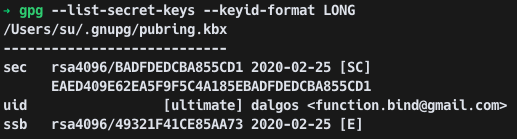

# github GPG key 등록하기

Install GPG command line tool

[GnuPG - Download](https://www.gnupg.org/download/index.html)

    brew install gpg
    brew cask install gpg-suite

기존에 생성된 GPG키가 있는지 조회합니다.

    gpg --list-secret-keys --keyid-format LONG

키가 없는 것을 확인했다면, GPG 키를 생성합니다.

    gpg --full-generate-key

    1. RSA and DSA
    2. 4096 bits

rsa4096/ 뒤쪽의 문자열이 gpg key id

    gpg --armor --export BADFDEDCBA855CD1 | pbcopy

복사된 키를 github 계정에 추가합니다.

Signing Commit 사용을 위해 git config를 추가합니다.

    // local git
    git config commit.gpgsign true
    
    // global git
    git config --global commit.gpgsign true
    
    // signingkey 를 추가합니다.
    git config --global user.siginingkey 0x{key-id}

git commit 시 `-S` 옵션을 추가합니다.

    git commit -S -v

commit 시 gpg 서명 실패 오류가 발생하는 경우 아래와 같이 조치합니다.

    // signingkey 추가
    git config --global user.signingkey 0x{key-id}
    
    git config --global gpg.program gpg2
    
    echo "test" | gpg2 --clearsign

아래는 참고할 만한 링크입니다.

[fixing `gpg failed to sign data` error on macOS](https://gist.github.com/cezaraugusto/2c91d141ddec026753051ffcace3f1f2)
